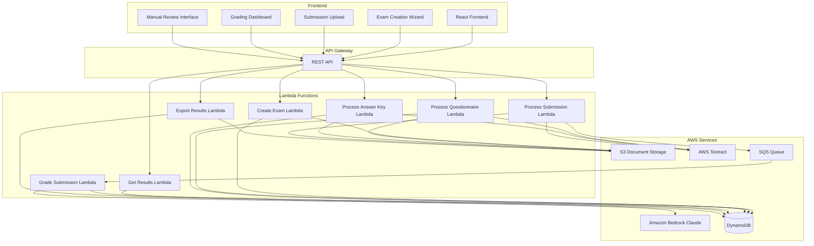

# Design Document: AI-Powered Exam Grading System

## Overview

The AI-Powered Exam Grading System is a comprehensive solution for automating the grading of handwritten student exams. The system consists of three main processing pipelines:

1. **Exam Creation Pipeline**: Extracts questions from exam questionnaires and processes answer keys
2. **Submission Processing Pipeline**: Uses AWS Textract to extract handwritten text from scanned student submissions
3. **AI Grading Pipeline**: Uses Amazon Bedrock (Claude) to semantically compare student answers with answer keys and generate grades with confidence scores

The system is built on AWS serverless architecture using Lambda functions, DynamoDB for data persistence, S3 for document storage, and integrates with existing multi-tenant infrastructure. A dedicated "Advanced" section in the frontend provides teachers with a wizard-based interface for exam creation, batch submission upload, and comprehensive grading review capabilities.

## Architecture

### High-Level Architecture



### Component Architecture

The system follows a microservices architecture with clear separation of concerns:

- **Document Processing Layer**: Handles file uploads, format conversion, and text extraction
- **AI Processing Layer**: Manages semantic comparison and grading logic
- **Data Layer**: Provides persistence and retrieval of exams, submissions, and results
- **Presentation Layer**: Delivers teacher-facing interfaces for all workflows

### Multi-Tenant Considerations

The system integrates with existing multi-tenant infrastructure:
- All DynamoDB records include `customerId` partition key
- S3 objects are prefixed with `{customerId}/exams/`
- Lambda functions receive customer context from API Gateway authorizer
- Cost tracking is aggregated per customer

## Components and Interfaces

### 1. Document Processor Component

**Responsibility**: Extract text and structure from PDF/DOCX documents

**Interfaces**:
```typescript
interface DocumentProcessor {
  extractQuestionsFromQuestionnaire(
    documentUrl: string,
    customerId: string
  ): Promise<ExtractedQuestionnaire>;
  
  extractAnswerKeyMappings(
    documentUrl: string,
    customerId: string
  ): Promise<AnswerKeyMapping[]>;
  
  validateDocumentFormat(
    fileBuffer: Buffer,
    expectedFormat: DocumentFormat
  ): boolean;
}

interface ExtractedQuestionnaire {
  sections: Section[];
  totalQuestions: number;
  extractionConfidence: number;
}

interface Section {
  sectionNumber: number;
  sectionTitle: string;
  questions: Question[];
}

interface Question {
  questionNumber: string;
  questionText: string;
  points: number;
  sectionId: string;
}

interface AnswerKeyMapping {
  questionNumber: string;
  expectedAnswer: string;
  keywords: string[];
}

type DocumentFormat = 'PDF' | 'DOCX' | 'IMAGE';
```

**Implementation Details**:
- Uses AWS Textract `AnalyzeDocument` API with `TABLES` and `FORMS` features for structured extraction
- For DOCX files, uses `mammoth.js` library to convert to HTML, then parses structure
- Implements heuristics to detect question boundaries (numbered patterns, section headers)
- Validates extraction quality by checking for expected patterns (question numbers, point values)

### 2. Handwriting Recognizer Component

**Responsibility**: Extract handwritten text from scanned student submissions

**Interfaces**:
```typescript
interface HandwritingRecognizer {
  extractHandwrittenAnswers(
    documentUrl: string,
    examStructure: ExtractedQuestionnaire,
    customerId: string
  ): Promise<ExtractedAnswers>;
  
  getExtractionConfidence(
    textractResponse: TextractResponse
  ): number;
}

interface ExtractedAnswers {
  studentId: string;
  answers: StudentAnswer[];
  overallConfidence: number;
  flaggedForReview: string[]; // question numbers
}

interface StudentAnswer {
  questionNumber: string;
  extractedText: string;
  confidence: number;
  boundingBox: BoundingBox;
}

interface BoundingBox {
  top: number;
  left: number;
  width: number;
  height: number;
}
```

**Implementation Details**:
- Uses AWS Textract `AnalyzeDocument` API with `SIGNATURES` feature type for handwriting
- Implements spatial analysis to map extracted text blocks to question numbers
- Uses bounding box coordinates to determine which text belongs to which question
- Flags answers with confidence < 50% for manual review
- Handles multi-page submissions by maintaining page-to-question mapping

### 3. AI Grading Engine Component

**Responsibility**: Semantically compare student answers with answer keys and assign grades

**Interfaces**:
```typescript
interface AIGradingEngine {
  gradeAnswer(
    studentAnswer: string,
    expectedAnswer: string,
    questionContext: QuestionContext,
    customerId: string
  ): Promise<GradingDecision>;
  
  batchGradeSubmission(
    submission: ExtractedAnswers,
    answerKey: AnswerKeyMapping[],
    examContext: ExamContext,
    customerId: string
  ): Promise<GradingResult>;
}

interface QuestionContext {
  questionNumber: string;
  questionText: string;
  maxPoints: number;
  keywords: string[];
}

interface ExamContext {
  examId: string;
  examTitle: string;
  totalPoints: number;
  questions: Question[];
}

interface GradingDecision {
  questionNumber: string;
  marksAwarded: number;
  maxMarks: number;
  confidence: number;
  explanation: string;
  isPartialCredit: boolean;
  requiresReview: boolean;
}

interface GradingResult {
  submissionId: string;
  studentId: string;
  examId: string;
  decisions: GradingDecision[];
  totalScore: number;
  maxScore: number;
  averageConfidence: number;
  gradedAt: string;
  costTracking: CostTracking;
}

interface CostTracking {
  textractPages: number;
  textractCost: number;
  bedrockTokensInput: number;
  bedrockTokensOutput: number;
  bedrockCost: number;
  totalCost: number;
}
```

**Implementation Details**:
- Uses Amazon Bedrock Claude 3 (Sonnet or Haiku) for semantic comparison
- Constructs prompts with: question text, expected answer, student answer, grading rubric
- Prompt engineering includes:
  - Instructions to evaluate semantic similarity, not exact matching
  - Guidelines for partial credit based on completeness
  - Request for confidence score and explanation
  - JSON response format for structured parsing
- Implements retry logic with exponential backoff for Bedrock API calls
- Tracks token usage for cost calculation
- Sets `requiresReview = true` when confidence < 70%

**Example Prompt Structure**:
```
You are an expert exam grader. Grade the following student answer.

Question: {questionText}
Expected Answer: {expectedAnswer}
Student Answer: {studentAnswer}
Maximum Points: {maxPoints}

Evaluate the student's answer based on:
1. Semantic similarity to the expected answer
2. Completeness of the response
3. Accuracy of key concepts

Provide your grading in JSON format:
{
  "marksAwarded": <number>,
  "confidence": <0-100>,
  "explanation": "<brief explanation>",
  "isPartialCredit": <boolean>
}
```

### 4. Exam Management Service

**Responsibility**: Manage exam lifecycle (creation, retrieval, updates)

**Interfaces**:
```typescript
interface ExamManagementService {
  createExam(
    examData: CreateExamRequest,
    customerId: string
  ): Promise<Exam>;
  
  getExam(
    examId: string,
    customerId: string
  ): Promise<Exam>;
  
  listExams(
    customerId: string,
    filters?: ExamFilters
  ): Promise<Exam[]>;
  
  updateExamQuestions(
    examId: string,
    questions: Question[],
    customerId: string
  ): Promise<void>;
  
  deleteExam(
    examId: string,
    customerId: string
  ): Promise<void>;
}

interface CreateExamRequest {
  title: string;
  questionnaireUrl: string;
  answerKeyUrl: string;
  teacherId: string;
}

interface Exam {
  examId: string;
  customerId: string;
  teacherId: string;
  title: string;
  createdAt: string;
  updatedAt: string;
  questionnaire: ExtractedQuestionnaire;
  answerKey: AnswerKeyMapping[];
  status: ExamStatus;
  submissionCount: number;
  totalCost: number;
}

type ExamStatus = 'DRAFT' | 'ACTIVE' | 'ARCHIVED';

interface ExamFilters {
  status?: ExamStatus;
  teacherId?: string;
  createdAfter?: string;
  createdBefore?: string;
}
```

### 5. Submission Management Service

**Responsibility**: Manage student submission lifecycle and grading results

**Interfaces**:
```typescript
interface SubmissionManagementService {
  createSubmission(
    submissionData: CreateSubmissionRequest,
    customerId: string
  ): Promise<Submission>;
  
  getSubmission(
    submissionId: string,
    customerId: string
  ): Promise<Submission>;
  
  listSubmissions(
    examId: string,
    customerId: string
  ): Promise<Submission[]>;
  
  updateGrade(
    submissionId: string,
    questionNumber: string,
    manualGrade: ManualGradeOverride,
    customerId: string
  ): Promise<void>;
  
  finalizeSubmission(
    submissionId: string,
    customerId: string
  ): Promise<void>;
}

interface CreateSubmissionRequest {
  examId: string;
  studentId: string;
  studentName: string;
  documentUrl: string;
}

interface Submission {
  submissionId: string;
  examId: string;
  customerId: string;
  studentId: string;
  studentName: string;
  submittedAt: string;
  processedAt?: string;
  status: SubmissionStatus;
  extractedAnswers?: ExtractedAnswers;
  gradingResult?: GradingResult;
  manualOverrides: ManualGradeOverride[];
  isFinalized: boolean;
}

type SubmissionStatus = 
  | 'UPLOADED' 
  | 'PROCESSING' 
  | 'GRADED' 
  | 'REVIEW_REQUIRED' 
  | 'FINALIZED' 
  | 'FAILED';

interface ManualGradeOverride {
  questionNumber: string;
  originalMarks: number;
  overriddenMarks: number;
  reason: string;
  reviewedBy: string;
  reviewedAt: string;
}
```

### 6. Export Service

**Responsibility**: Generate CSV/Excel exports of grading results

**Interfaces**:
```typescript
interface ExportService {
  exportToCSV(
    examId: string,
    customerId: string
  ): Promise<ExportResult>;
  
  exportToExcel(
    examId: string,
    customerId: string
  ): Promise<ExportResult>;
}

interface ExportResult {
  exportId: string;
  downloadUrl: string;
  expiresAt: string;
  format: 'CSV' | 'EXCEL';
  recordCount: number;
}
```

**Implementation Details**:
- Generates CSV using `csv-stringify` library
- Generates Excel using `exceljs` library
- Export includes: student info, per-question marks, confidence scores, explanations, manual overrides
- Uploads export file to S3 with pre-signed URL (expires in 1 hour)
- Export format includes columns: Student ID, Student Name, Question Number, Marks Awarded, Max Marks, Confidence, AI Explanation, Manual Override, Reviewed By, Total Score

### 7. Frontend Components

**Advanced Section Navigation**:
- New top-level navigation item: "Advanced"
- Displays exam grading dashboard as landing page
- Provides quick access to exam creation wizard

**Exam Creation Wizard**:
- Step 1: Upload questionnaire (drag-drop or file picker)
- Step 2: Review extracted questions (editable table)
- Step 3: Upload answer key
- Step 4: Review answer mappings (validation checks)
- Step 5: Confirm and create exam

**Submission Upload Interface**:
- Single file upload with student info form
- Batch upload with CSV mapping (filename → student ID)
- Progress indicators for each upload
- Real-time status updates via WebSocket or polling

**Grading Dashboard**:
- Table view: Student Name, Total Score, Status, Confidence, Actions
- Color-coded confidence indicators (green/yellow/red)
- Filter by status (All, Review Required, Finalized)
- Sort by score, confidence, student name
- Bulk actions: Approve High Confidence, Export Results

**Manual Review Interface**:
- Split view: Left (student answer), Right (expected answer)
- Grade input with slider or number input
- AI explanation display
- Approve/Modify/Reject buttons
- Navigation: Previous/Next flagged question
- Progress indicator: "3 of 12 questions reviewed"

## Data Models

### DynamoDB Table Structure

**Table: Exams**
```typescript
interface ExamRecord {
  // Partition Key
  PK: string; // "CUSTOMER#{customerId}"
  
  // Sort Key
  SK: string; // "EXAM#{examId}"
  
  // Attributes
  examId: string;
  customerId: string;
  teacherId: string;
  title: string;
  createdAt: string; // ISO 8601
  updatedAt: string;
  status: ExamStatus;
  
  // Questionnaire data
  questionnaireS3Key: string;
  sections: Section[];
  totalQuestions: number;
  totalPoints: number;
  
  // Answer key data
  answerKeyS3Key: string;
  answerMappings: AnswerKeyMapping[];
  
  // Metadata
  submissionCount: number;
  totalCost: number;
  
  // GSI attributes
  GSI1PK: string; // "TEACHER#{teacherId}"
  GSI1SK: string; // "EXAM#{createdAt}"
}
```

**Table: Submissions**
```typescript
interface SubmissionRecord {
  // Partition Key
  PK: string; // "EXAM#{examId}"
  
  // Sort Key
  SK: string; // "SUBMISSION#{submissionId}"
  
  // Attributes
  submissionId: string;
  examId: string;
  customerId: string;
  studentId: string;
  studentName: string;
  submittedAt: string;
  processedAt?: string;
  status: SubmissionStatus;
  
  // Document data
  documentS3Key: string;
  pageCount: number;
  
  // Extracted answers
  extractedAnswers?: ExtractedAnswers;
  extractionConfidence?: number;
  
  // Grading results
  gradingDecisions?: GradingDecision[];
  totalScore?: number;
  maxScore?: number;
  averageConfidence?: number;
  gradedAt?: string;
  
  // Manual overrides
  manualOverrides: ManualGradeOverride[];
  isFinalized: boolean;
  finalizedAt?: string;
  finalizedBy?: string;
  
  // Cost tracking
  costTracking?: CostTracking;
  
  // GSI attributes
  GSI1PK: string; // "CUSTOMER#{customerId}"
  GSI1SK: string; // "SUBMISSION#{submittedAt}"
  
  GSI2PK: string; // "STUDENT#{studentId}"
  GSI2SK: string; // "SUBMISSION#{submittedAt}"
}
```

**Global Secondary Indexes**:
- GSI1: `GSI1PK` (PK) + `GSI1SK` (SK) - Query exams by teacher, submissions by customer
- GSI2: `GSI2PK` (PK) + `GSI2SK` (SK) - Query submissions by student

### S3 Bucket Structure

```
{bucket-name}/
  {customerId}/
    exams/
      {examId}/
        questionnaire.pdf
        answer-key.docx
        submissions/
          {submissionId}/
            original.pdf
            extracted-text.json
    exports/
      {exportId}.csv
      {exportId}.xlsx
```

## Correctness Properties

*A property is a characteristic or behavior that should hold true across all valid executions of a system—essentially, a formal statement about what the system should do. Properties serve as the bridge between human-readable specifications and machine-verifiable correctness guarantees.*


### Property 1: Valid Document Format Acceptance

*For any* uploaded document with a valid format (PDF, DOCX, PNG, JPG), the system should accept the upload and proceed with processing.

**Validates: Requirements 1.1, 1.2, 1.3, 1.4, 1.5**

### Property 2: Invalid Document Format Rejection

*For any* uploaded document with an invalid or unsupported format, the system should reject the upload and return a clear error message indicating the unsupported format.

**Validates: Requirements 1.6**

### Property 3: Question Extraction Completeness

*For any* exam questionnaire document with N questions, the document processor should extract all N questions with their original numbering preserved.

**Validates: Requirements 2.1, 2.3**

### Property 4: Section Grouping Preservation

*For any* exam questionnaire with defined sections, all extracted questions should be correctly associated with their respective sections.

**Validates: Requirements 2.2, 2.5**

### Property 5: Answer Key Mapping Completeness

*For any* answer key document, the system should extract all question-answer mappings with complete answer text preserved and correctly associated with question numbers.

**Validates: Requirements 3.1, 3.2, 3.3**

### Property 6: Answer Key Validation

*For any* exam with N questions, if the answer key contains fewer than N answers, the system should flag all missing answers and notify the teacher.

**Validates: Requirements 3.4, 3.5**

### Property 7: Multi-Page Handwriting Extraction

*For any* multi-page student submission, the handwriting recognizer should extract text from all pages and associate each extracted answer with its corresponding question number.

**Validates: Requirements 4.2, 4.4**

### Property 8: Handwriting Recognition Data Persistence

*For any* processed student submission, the system should store all extracted answers linked to the correct student identifier.

**Validates: Requirements 4.5**

### Property 9: Low Confidence Flagging

*For any* extracted answer with confidence below 50%, or any grading decision with confidence below 70%, the system should set a manual review flag for that answer or question.

**Validates: Requirements 4.6, 6.4**

### Property 10: Semantic Equivalence Recognition

*For any* two answers that are semantically equivalent but textually different, the AI grading engine should assign similar marks (within 10% of each other).

**Validates: Requirements 5.2**

### Property 11: Confidence Score Bounds

*For any* grading decision, the confidence score should be a number between 0 and 100 (inclusive).

**Validates: Requirements 5.4**

### Property 12: Grading Explanation Presence

*For any* grading decision, the system should provide a non-empty text explanation for why the marks were awarded.

**Validates: Requirements 5.5**

### Property 13: Partial Credit Bounds

*For any* grading decision for a question worth M marks, the marks awarded should be between 0 and M (inclusive).

**Validates: Requirements 5.6**

### Property 14: Grading Result Completeness

*For any* graded submission, every question should have an associated mark, confidence score, and explanation.

**Validates: Requirements 6.1, 6.2, 6.3**

### Property 15: Total Score Calculation

*For any* graded submission with per-question marks, the total score should equal the sum of all per-question marks.

**Validates: Requirements 6.5**

### Property 16: Manual Review Flag Display

*For any* submission with questions flagged for manual review, all flagged questions should appear in the manual review interface.

**Validates: Requirements 7.1, 16.1**

### Property 17: Grade Override Preservation

*For any* manually overridden grade, the system should preserve both the original AI-generated grade and the manual override value with teacher identifier and timestamp.

**Validates: Requirements 7.3, 7.5, 10.5**

### Property 18: Grade Finalization State

*For any* grade that is approved or overridden by a teacher, the system should mark that grade as finalized.

**Validates: Requirements 7.4, 7.6**

### Property 19: Batch Upload Acceptance

*For any* batch upload of N student submissions, the system should accept all N submissions and initiate processing for each.

**Validates: Requirements 8.1**

### Property 20: Batch Processing Error Isolation

*For any* batch processing operation where K out of N submissions fail, the system should successfully process the remaining (N-K) submissions and report all K failures.

**Validates: Requirements 8.6**

### Property 21: Batch Processing Progress Tracking

*For any* batch processing operation with N submissions, the system should emit progress updates for each of the N submissions.

**Validates: Requirements 8.4**

### Property 22: Export Format Generation

*For any* export request, the system should generate both CSV and Excel format files containing all grading results.

**Validates: Requirements 9.1, 9.2**

### Property 23: Export Data Completeness

*For any* exported grading results, the export should include student information, per-question marks, total scores, confidence scores, AI explanations, and manual override indicators for every submission.

**Validates: Requirements 9.3, 9.4, 9.5**

### Property 24: Data Persistence Round Trip

*For any* exam, answer key, submission, or grading result that is stored, retrieving it should return data equivalent to what was originally stored.

**Validates: Requirements 10.1, 10.2, 10.3, 10.4, 10.6**

### Property 25: Cost Tracking Recording

*For any* document processed by Textract or answer graded by Bedrock, the system should record the number of pages processed or tokens used.

**Validates: Requirements 11.1, 11.2**

### Property 26: Cost Calculation Accuracy

*For any* exam with recorded Textract and Bedrock usage, the calculated costs should equal (pages × Textract_rate) + (tokens × Bedrock_rate).

**Validates: Requirements 11.3, 11.4**

### Property 27: Cost Aggregation Per Customer

*For any* customer with multiple exams, the cumulative cost should equal the sum of costs for all their exams.

**Validates: Requirements 11.5**

### Property 28: Cost Threshold Notification

*For any* customer whose cumulative costs exceed the configured threshold, the system should send a notification to the system administrator.

**Validates: Requirements 11.6**

### Property 29: Dashboard Exam Display

*For any* customer with N created exams, the dashboard should display all N exams with their grading status.

**Validates: Requirements 12.3, 12.4**

### Property 30: Wizard Question Review and Edit

*For any* questionnaire uploaded through the wizard, the extracted questions should be displayed for review and any edits made should be reflected in the saved exam.

**Validates: Requirements 13.3, 13.6**

### Property 31: Submission Upload Validation

*For any* submission upload without required student identification information, the system should reject the upload with a validation error.

**Validates: Requirements 14.4**

### Property 32: Upload Completion Workflow

*For any* successfully uploaded submission, the system should confirm the upload and automatically begin processing.

**Validates: Requirements 14.6**

### Property 33: Student Results Display

*For any* exam with N student submissions, the grading results dashboard should display all N students with their total scores and grading status.

**Validates: Requirements 15.1, 15.2**

### Property 34: Confidence Color Coding

*For any* displayed confidence score, the system should apply green color for scores ≥80%, yellow for scores 70-79%, and red for scores <70%.

**Validates: Requirements 15.5**

### Property 35: Grade Modification Reason Requirement

*For any* manual grade modification, the system should require a non-empty reason before accepting the modification.

**Validates: Requirements 16.4**

### Property 36: Bulk Approve High Confidence Filter

*For any* bulk approve operation, the system should approve only grades with confidence ≥80% and mark them as finalized.

**Validates: Requirements 17.2, 17.4**

### Property 37: Bulk Action Preview Count

*For any* bulk action, the system should display the accurate count of grades that would be affected before the action is applied.

**Validates: Requirements 17.6**

### Property 38: AI Grading Failure Flagging

*For any* question where AI grading fails, the system should flag that question for manual grading.

**Validates: Requirements 19.4**

### Property 39: Batch Processing Resumption

*For any* interrupted batch processing operation that successfully processed K submissions before interruption, resuming should continue from submission K+1.

**Validates: Requirements 19.5**

### Property 40: Error Data Preservation

*For any* error that occurs during processing, all data successfully processed before the error should remain intact and accessible.

**Validates: Requirements 19.6**

### Property 41: Multi-Tenant Exam Association

*For any* exam created by a teacher, the exam should be associated with that teacher's customer account identifier.

**Validates: Requirements 20.1, 20.4**

### Property 42: Multi-Tenant Data Isolation

*For any* query for exams or submissions by a teacher, the system should return only data belonging to that teacher's customer account.

**Validates: Requirements 20.2, 20.3**

### Property 43: Cross-Customer Access Denial

*For any* attempt by a teacher to access data belonging to a different customer account, the system should deny access and log the attempt.

**Validates: Requirements 20.6**

## Error Handling

### Document Processing Errors

**Invalid Format Errors**:
- Detect unsupported file formats during upload validation
- Return HTTP 400 with error message: "Unsupported file format. Please upload PDF, DOCX, PNG, or JPG files."
- Log error with file metadata for debugging

**Extraction Failures**:
- If Textract returns empty results, retry once with different parameters
- If retry fails, return error to teacher with option to manually enter questions
- Store partial extraction results if any questions were successfully extracted
- Log extraction confidence scores for monitoring

**Corrupted Document Errors**:
- Detect corrupted files during initial processing
- Return HTTP 400 with error message: "Unable to read document. File may be corrupted."
- Suggest re-scanning or re-uploading the document

### AI Grading Errors

**Bedrock API Failures**:
- Implement exponential backoff retry (3 attempts: 1s, 2s, 4s delays)
- If all retries fail, flag question for manual grading
- Store error details in submission record
- Continue grading remaining questions

**Timeout Errors**:
- Set 30-second timeout for each Bedrock API call
- On timeout, retry once with shorter context
- If retry fails, flag for manual grading
- Log timeout occurrences for performance monitoring

**Rate Limiting**:
- Implement token bucket algorithm for Bedrock API calls
- Queue grading requests when rate limit approached
- Display "Processing..." status to teacher
- Process queued requests as capacity becomes available

### Data Persistence Errors

**DynamoDB Write Failures**:
- Retry failed writes up to 3 times with exponential backoff
- If write fails after retries, return HTTP 500 to client
- Log error with full context for debugging
- Implement dead letter queue for failed writes

**S3 Upload Failures**:
- Retry failed uploads up to 3 times
- If upload fails, clean up any partial uploads
- Return error to teacher with option to retry
- Log error with file metadata

### Batch Processing Errors

**Individual Submission Failures**:
- Continue processing remaining submissions
- Store error details for failed submissions
- Display failed submissions separately in UI
- Provide retry option for failed submissions

**System Resource Errors**:
- Monitor Lambda memory and timeout limits
- If approaching limits, pause batch processing
- Process remaining submissions in next batch
- Notify teacher of partial completion

### Validation Errors

**Missing Required Fields**:
- Validate all required fields before processing
- Return HTTP 400 with specific field errors
- Example: "Student ID is required for submission upload"

**Data Integrity Errors**:
- Validate question-answer mapping completeness
- Validate score calculations (sum of parts = total)
- Return HTTP 400 with validation details
- Prevent data corruption by rejecting invalid updates

## Testing Strategy

### Unit Testing Approach

Unit tests focus on specific examples, edge cases, and integration points:

**Document Processing**:
- Test PDF parsing with sample documents
- Test DOCX parsing with sample documents
- Test question number extraction patterns (1, 1a, 1.1, etc.)
- Test section boundary detection
- Test error handling for corrupted files

**Handwriting Recognition**:
- Test Textract response parsing
- Test spatial analysis for question mapping
- Test confidence score calculation
- Test multi-page document handling

**AI Grading**:
- Test prompt construction
- Test response parsing
- Test partial credit calculation
- Test error handling for API failures

**Data Layer**:
- Test DynamoDB CRUD operations
- Test S3 upload/download
- Test query filtering by customer ID
- Test cost calculation formulas

**API Endpoints**:
- Test authentication and authorization
- Test request validation
- Test response formatting
- Test error responses

### Property-Based Testing Approach

Property tests verify universal properties across randomized inputs. Each test should run minimum 100 iterations.

**Testing Library**: Use `fast-check` for TypeScript/JavaScript property-based testing

**Test Configuration**:
```typescript
import fc from 'fast-check';

// Example configuration
fc.assert(
  fc.property(
    // generators here
    (input) => {
      // property assertion here
    }
  ),
  { numRuns: 100 } // minimum 100 iterations
);
```

**Property Test Categories**:

1. **Document Format Validation Properties** (Properties 1-2)
   - Generate random file buffers with various formats
   - Verify valid formats are accepted, invalid rejected
   - Tag: **Feature: exam-grading-system, Property 1: Valid format acceptance**

2. **Extraction Completeness Properties** (Properties 3-6)
   - Generate documents with known question counts
   - Verify all questions extracted with correct associations
   - Tag: **Feature: exam-grading-system, Property 3: Question extraction completeness**

3. **Grading Logic Properties** (Properties 10-15)
   - Generate random student answers and expected answers
   - Verify confidence bounds, score bounds, completeness
   - Tag: **Feature: exam-grading-system, Property 11: Confidence score bounds**

4. **Data Persistence Properties** (Property 24)
   - Generate random exam/submission data
   - Verify round-trip: store then retrieve equals original
   - Tag: **Feature: exam-grading-system, Property 24: Data persistence round trip**

5. **Cost Calculation Properties** (Properties 25-28)
   - Generate random usage data
   - Verify cost calculations and aggregations
   - Tag: **Feature: exam-grading-system, Property 26: Cost calculation accuracy**

6. **Multi-Tenant Isolation Properties** (Properties 41-43)
   - Generate data for multiple customers
   - Verify data isolation and access control
   - Tag: **Feature: exam-grading-system, Property 42: Multi-tenant data isolation**

7. **Batch Processing Properties** (Properties 19-21)
   - Generate batches of submissions with some failures
   - Verify error isolation and progress tracking
   - Tag: **Feature: exam-grading-system, Property 20: Batch processing error isolation**

8. **UI State Properties** (Properties 16-18, 29-37)
   - Generate random grading states
   - Verify correct filtering, display, and state transitions
   - Tag: **Feature: exam-grading-system, Property 16: Manual review flag display**

**Generator Examples**:

```typescript
// Generate valid document formats
const validFormatGen = fc.constantFrom('PDF', 'DOCX', 'PNG', 'JPG');

// Generate exam with questions
const examGen = fc.record({
  examId: fc.uuid(),
  questions: fc.array(fc.record({
    questionNumber: fc.string(),
    questionText: fc.string(),
    points: fc.integer({ min: 1, max: 10 })
  }), { minLength: 1, maxLength: 50 })
});

// Generate confidence scores
const confidenceGen = fc.float({ min: 0, max: 100 });

// Generate grading decision
const gradingDecisionGen = fc.record({
  questionNumber: fc.string(),
  marksAwarded: fc.float({ min: 0, max: 10 }),
  maxMarks: fc.constant(10),
  confidence: confidenceGen,
  explanation: fc.string({ minLength: 10 })
});
```

### Integration Testing

Integration tests verify component interactions:

**End-to-End Workflows**:
- Test complete exam creation workflow
- Test complete submission grading workflow
- Test manual review and override workflow
- Test export generation workflow

**AWS Service Integration**:
- Test Textract integration with real documents
- Test Bedrock integration with real prompts
- Test DynamoDB operations with real data
- Test S3 operations with real files

**Multi-Tenant Scenarios**:
- Test data isolation between customers
- Test concurrent operations by different customers
- Test cost tracking per customer

### Performance Testing

**Load Testing**:
- Test batch processing of 30 submissions (target: <5 minutes)
- Test concurrent exam creation by multiple teachers
- Test dashboard loading with 100+ exams

**Stress Testing**:
- Test system behavior under high load
- Test graceful degradation when limits reached
- Test recovery after failures

### Test Coverage Goals

- Unit test coverage: >80% for business logic
- Property test coverage: All 43 properties implemented
- Integration test coverage: All critical workflows
- E2E test coverage: All user-facing features

### Continuous Testing

- Run unit tests on every commit
- Run property tests on every PR
- Run integration tests nightly
- Run performance tests weekly
- Monitor test execution time and flakiness
